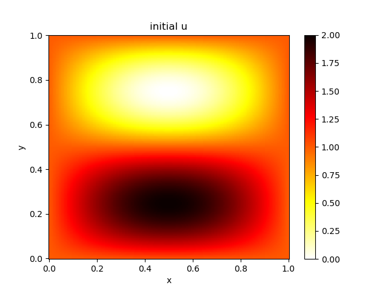

# 2025年度・PCゼミ第3回

## 問題設定
偏微分方程式を数値的に解き，NetCDF形式で出力する．  
$0 \le x \le 1, 0 \le y \le 1$の範囲で
```math
\frac{\partial u}{\partial t} = \frac{\partial ^2 u}{\partial x^2} + \frac{\partial ^2 u}{\partial y^2} + F
```
のDirichlet境界問題
```math
u(0,y)=u(1,y)=u(x,0)=u(x,1)=0
```
を解く．
$u=u(x,y,t)$は無次元温度，$F=F(x,y)$ は強制項(熱源)とする．

### 時間・空間離散化
簡単のためx,y 方向を同じグリッド数で離散化する．
```math
n_x = n_y
```
水平方向の差分$\delta h = 1/n_x = 1/n_y$を用いて，2階微分は次のように離散化できる．
```math
\frac{\partial ^2 u(i,j)}{\partial x^2}  \approx  \frac{u(i-1,j) + u(i+1,j) - 2u(i,j)}{\delta h^2}
```
また時間方向の離散化には前進Euler法を用いる．
$t$ステップ目の$u$を$u^{(t)}$とおくと，$(t+1)$ステップ目の$u$は
```math
u^{(t+1)}(i,j) = u^{(t)}(i,j) + \frac{\delta t}{\delta h^2} \lbrack u^{(t)}(i-1,j) + u^{(t)}(i+1,j)+ u^{(t)}(i,j-1)+u^{(t)}(i,j+1)-4u^{(t)}(i,j) \rbrack + \delta t F(i,j)
```

## Dependencies
初期値作成・時間積分
- GNU Fortranコンパイラ(gfortran)
- NetCDF-c,NetCDF-Fortran

描画スクリプト
- Python
- Numpy
- xarray
- matplotlib
- tqdm
- ffmpeg


環境構築例
- [Miniconda](./doc/miniconda_install.md)
## データダウンロード
強制項を保存したファイルは[ここから](https://drive.google.com/file/d/1ce9I2_WtM37T9ivTh3FmA1rdrERCUxmT/view?usp=sharing)ダウンロードし，```run/data```ディレクトリ直下に置く．

## Build
```build```ディレクトリ内でビルドする(out-of sourceビルド)
.  
```build/bin```ディレクトリ以下に実行ファイル
- ```init_sine```(初期値作成プログラム)
- ```forward```(時間積分プログラム)

が生成される．
この実行ファイルは実行ディレクトリ```run```へシンボリックリンクでリンクされている．

### Cmakeを使ったコンパイル
トップディレクトリ内で
```
./compile.bash
```
を実行する．
### Cmakeを使わないコンパイル
トップディレクトリ内で
```
./compile_no_use_cmake.bash
```
を実行する．
### clean
トップディレクトリ内で
```
./clean.bash
```
を実行することでビルドでできるファイルを削除する．


## Usage
### ディレクトリ構造
|ディレクトリ名|説明|
| :---: | :---: |
|build|実行ファイル生成場所|
|include|NetCDFのモジュールファイル|
|lib|netCDFの動的ライブラリ|
|run|実行場所|
|src|ソースコード|

### 手順
実行場所```run```に移動する．
#### 1 初期値作成
```
./init_sine
```
```data```ディレクトリ直下に```init.nc```ファイルが生成される．

### 1.5 初期値を描画
```plot_u_init.py```で初期値を描画する．
```
python plot_u_init.py
```
初期値(2次元温度分布)を示した```fig/init/init.png```が出力される．


### 2 時間積分
```config.txt```に計算設定を記述する．
ただし，現時点では本ファイルの変更は初期値・強制項の設定に反映されない.  
したがって，時間積分のみに関連する要素
- ```nt```(計算ステップ数)
- ```skipt```(出力ステップ数)
- ```dt```(計算時間間隔)  

のみ変更可能．    
また前進Euiler法による時間積分を行っているため，```dt```を変更する際はCFL条件に注意されたい．

```forward```を実行する．
```
./forward
```
計算結果を収めた```data/output.nc```が出力される．

### 2.5 計算結果の確認
```plot_u_all.py```で各ステップごとの温度分布を描画する．
```
python Plot_u_all.py 
```
画像は```fig/output```直下の出力される．

上記画像を元に，時間発展のようすを動画で出力する．
```animation.bash```を実行する．
```
bash animation.bash
```
```fig/animation```以下にmp4形式で出力される([出力例](./doc/image/top/output.mp4))．


### 3.0 追加
気象分野でも頻出するPoisson方程式
```math
\frac{\partial ^2 u}{\partial x^2} + \frac{\partial ^2 u}{\partial y^2} = -F
```
は熱伝導方程式
```math
\frac{\partial u}{\partial t} = \frac{\partial ^2 u}{\partial x^2} + \frac{\partial ^2 u}{\partial y^2} + F
```
の定常解から求めることができる．(強制項$F$の符号に注意．)  
つまり，ラプラシアンが$F$となる$u$を求めるためには，熱伝導方程式を十分長い時間積分すればよい．
```config.txt```の```nt```を変更してみよう．  
また```plot_u_stable.py```で最終ステップの$u$を描画できる．


### 3.1 より高速に解くためには
熱伝導方程式を長い時間積分しPoisson方程式の解を求める手法は，連立一次方程式の解法の一つであるJacobi法とみなせる．$u$の時間発展を表す
```math
u^{(t+1)}(i,j) = u^{(t)}(i,j) + \frac{\delta t}{\delta h^2} \lbrack u^{(t)}(i-1,j) + u^{(t)}(i+1,j)+ u^{(t)}(i,j-1)+u^{(t)}(i,j+1)-4u^{(t)}(i,j) \rbrack + \delta t F(i,j)
```
を次のように変形することで，より収束が早まる(Gauss-Seidel法)．
```math
u^{(t+1)}(i,j) = u^{(t)}(i,j) + \frac{\delta t}{\delta h^2} \lbrack u^{(t+1)}(i-1,j) + u^{(t)}(i+1,j)+ u^{(t+1)}(i,j-1)+u^{(t)}(i,j+1)-4u^{(t)}(i,j) \rbrack + \delta t F(i,j)
```
  
さらに収束を早める手法として逐次過緩和(Successive Over Relaxation; SOR)法がある．
```math
u^{(t+1)}(i,j) = u^{(t)}(i,j) + \alpha \frac{\delta t}{\delta h^2} \lbrack u^{(t+1)}(i-1,j) + u^{(t)}(i+1,j)+ u^{(t+1)}(i,j-1)+u^{(t)}(i,j+1)-4u^{(t)}(i,j) \rbrack + \delta t F(i,j)
```
$\alpha$は緩和係数と呼ばれ，1から2の間で設定することが多い．


## Author
Sou Tomita
